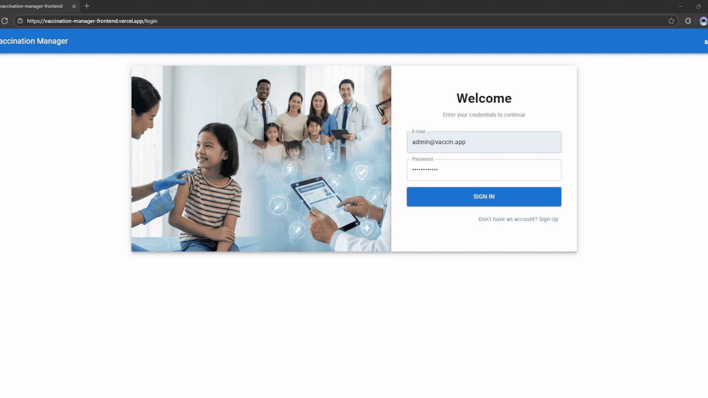

# Vaccination Manager Frontend

This repository houses the frontend interface for the **"Vaccination Manager"** technical challenge.
It is a modern Single Page Application (SPA) built with **React 19**, **TypeScript**, and **Vite**, designed to interact securely and efficiently with a .NET backend.

**Backend Repository:** [Vaccination Manager Backend](https://github.com/Ghitado/vaccination-manager-backend)



---

## Table of Contents

- [Overview](#overview)
- [Tech Stack](#tech-stack)
- [Features](#features)
- [How to Run](#how-to-run)
- [Project Structure](#project-structure)
- [Application Routes](#application-routes)
- [Architectural Decisions](#architectural-decisions)
- [Author](#author)

---

## Overview

The frontend provides a unified dashboard to manage the entire vaccination ecosystem.
It enables patient registration, vaccine inventory management, and the recording of administered doses directly onto the patient's digital card—all with real-time visual feedback.

---

## Tech Stack

- **Core:** React 19, TypeScript, Vite
- **Routing:** React Router DOM
- **UI Framework:** Material UI (MUI)
- **HTTP Client:** Axios (with Interceptors for Refresh Token)
- **State Management:** React Context API (Auth and Feedback)
- **Validation:** Zod (Schema Validation)
- **Authentication:** JWT with Refresh Token (via js-cookie)
- **Icons:** MUI Icons Material
- **Internationalization:** Custom React Context (No external libs)

---

## Features

### Authentication & Security

- **Login & Registration:** Professional "Split Screen" layout with instant visual validation.
- **Protected Routes:** Automatically redirects unauthenticated users to the login page.
- **Silent Refresh:** Automatically renews access tokens in the background upon expiration, without logging the user out.
- **Logout:** Securely clears cookies and redirects the user.

### Person Management (Patients)

- **Smart Listing:** Loads data in batches (100 items) to enable instant client-side search and pagination, minimizing server requests.
- **CRUD:** Create and delete operations with visual feedback (Toast notifications).
- **Vaccination Card (Smart Modal):**
  - _Visualization:_ Complete vaccination history grouped by date.
  - _Quick Action:_ Register new doses directly within the modal using Autocomplete.
  - _Validation:_ Prevents future dates and invalid entries.

### Vaccine Management

- **Inventory Control:** Register and view available vaccines.
- **Integrated Search:** Uses the same local filtering logic for quick lookups.

### Internationalization (i18n)

- **Dual Language Support:** Native support for **English (EN)** and **Portuguese (PT-BR)**.
- **Instant Toggle:** Users can switch languages instantly without reloading the page, persisting their preference via LocalStorage.

### Server Warm-up (Cold Start)

- **User-Friendly Waiting:** Since the backend is on a free tier, it "sleeps" after inactivity. I added a dedicated modal that keeps the user informed while the server wakes up, instead of showing a generic error.

---

## How to Run

### Prerequisites

- Node.js (v18 or higher)
- The Backend API running locally or in the cloud

### Installation

1. Clone the repository:

```bash
git clone [https://github.com/Ghitado/vaccination-manager-frontend.git](https://github.com/Ghitado/vaccination-manager-frontend.git)
cd vaccination-manager-frontend
```

### Install dependencies:

```bash
npm install
```

### Environment Setup

Create a `.env` file in the root directory to define the API URL. The backend defaults to `https://localhost:5001`.

```bash
VITE_API_URL=https://localhost:5001
```

### Running

Start the development server:

```bash
npm run dev
```

Visit:

```bash
http://localhost:5173
```

---

## Project Structure

The architecture follows a **Feature-First** pattern with a clear **Separation of Concerns**:

```bash
src/
├── api/                # Axios setup and service calls
│   ├── client.ts       # Request/Response Interceptors and Refresh Token
│   └── ...
├── components/
│   ├── common/         # Shared components (LanguageSwitcher, Pagination)
│   ├── auth/           # Login components
│   ├── layout/         # Global structure (Navbar)
│   ├── persons/        # Person-specific components
│   ├── vaccination-card/ # Complex logic for the Vaccination Modal
│   │   ├── VaccinationCardModal.tsx  # Orchestrator
│   │   ├── VaccinationForm.tsx       # Zod-validated form
│   │   └── VaccinationHistory.tsx    # History table
│   └── vaccines/
├── constants/          # Static Data & Dictionaries (translations.ts)
├── contexts/           # Global State (Auth, Feedback, Language)
├── pages/              # Main screens (LoginPage, PersonPage, VaccinePage)
├── routes/             # Route configuration (AppRoutes, ProtectedRoute)
├── App.tsx             # App Shell
└── main.tsx            # Entry point
```

---

## Application Routes

Navigation is handled by **React Router DOM**, ensuring a smooth Single Page Application (SPA) experience. Routes are categorized as either public or protected via a `ProtectedRoute` guard.

| Path        | Main Component | Description                                                                                  | Access  |
| :---------- | :------------- | :------------------------------------------------------------------------------------------- | :-----: |
| `/login`    | `LoginPage`    | Authentication screen ("Split Screen"). Redirects to the dashboard if a valid token exists.  | Public  |
| `/`         | `Layout`       | Root route. Automatically redirects to `/persons` after login.                               | Private |
| `/persons`  | `PersonPage`   | Patient management dashboard. Includes listing, registration, and the **Vaccination Modal**. | Private |
| `/vaccines` | `VaccinePage`  | Inventory management and available vaccine types.                                            | Private |
| `*`         | `NotFound`     | Fallback for non-existent URLs (404 Error).                                                  | Public  |

---

## Architectural Decisions

The goal here was balance: delivering clean, functional code (MVP) without **over-engineering**.

### 1. Cookies & Security

I chose `js-cookie` to manage JWTs. While I acknowledge that **HttpOnly Cookies** are the gold standard against XSS, handling them client-side allowed for a faster implementation of the _Refresh Token_ flow and login persistence without requiring complex CORS/Proxy configurations on the backend at this stage.

### 2. Forms (Simplicity vs. Libraries)

For forms, I stuck to standard `useState`. Since screens have very few fields, using a heavy library like _React Hook Form_ would be **overkill** right now. However, the structure is clean enough to easily migrate for rendering performance if the project scales.

### 3. State Management

No Redux or Zustand. React's native **Context API** perfectly handles sharing user sessions (Auth) and visual feedback (Toasts) across the app, avoiding unnecessary boilerplate.

### 4. UI (MUI)

Choosing **Material-UI (MUI)** was a strategic move for development speed. I leveraged Grid and Stack components to ensure responsiveness and a polished look "out-of-the-box," avoiding the need for manual CSS layouting.

### 5. Error Handling

I centralized all API calls in the `src/api` folder. This keeps the code clean and makes it easy to add global error handling or retry policies in the future. On the UI, the focus was preventive: validating fields before the user even tries to submit.

### 6. Internationalization Strategy

I avoided heavy libraries like `react-i18next` intentionally. I implemented a lightweight, type-safe translation system using **React Context**. This approach reduces the final bundle size and proves that complex features can be solved with native tools when the scope allows.

### 7. Handling Server "Cold Starts"

Since the backend runs on a free tier, it goes to sleep when idle. I implemented a specific check that keeps the user on a waiting screen while the server is **spinning up**. This prevents random connection errors and ensures the app only loads when the API is actually ready.

---

## Author

Developed by **Thiago de Melo Mota** as part of a technical challenge.
